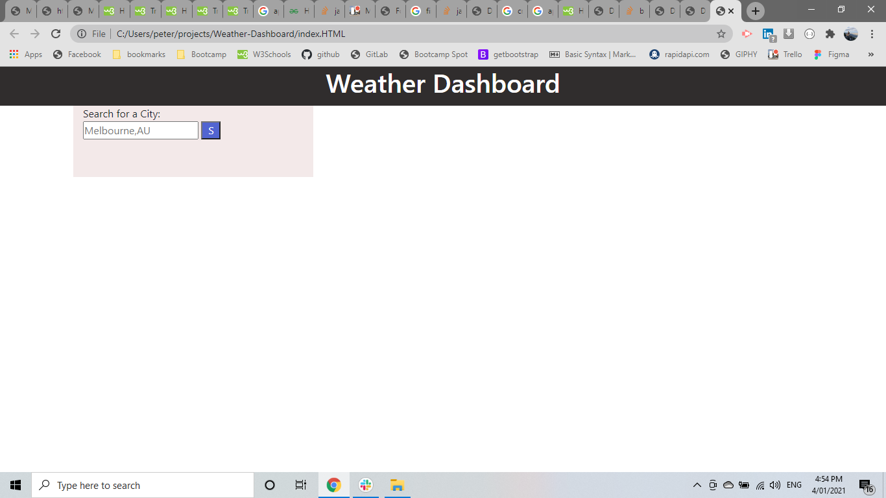
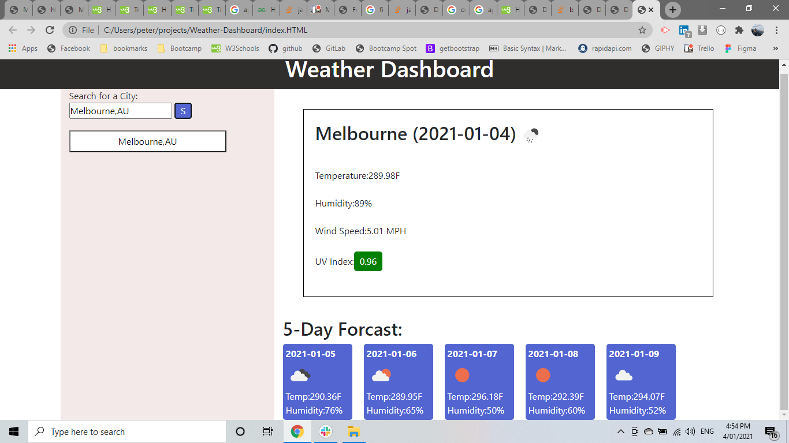
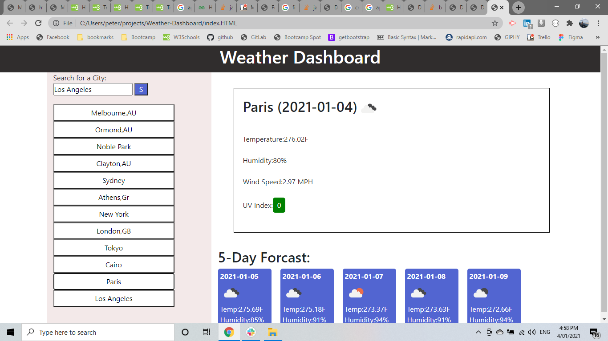

# Weather-Dashboard

link of repository :   https://github.com/pfotis/Weather-Dashboard

link of webpage    :   https://pfotis.github.io/Weather-Dashboard/

At this project the user can see the weather for each city likes for the same day and the next 5 days. Additional the choices will save at the local storage of the browser for the future. The user can see the UV index and depends from the high will change color the digits.

## First look of the website

## the user could search more cities in austrlia or out of australia.  

